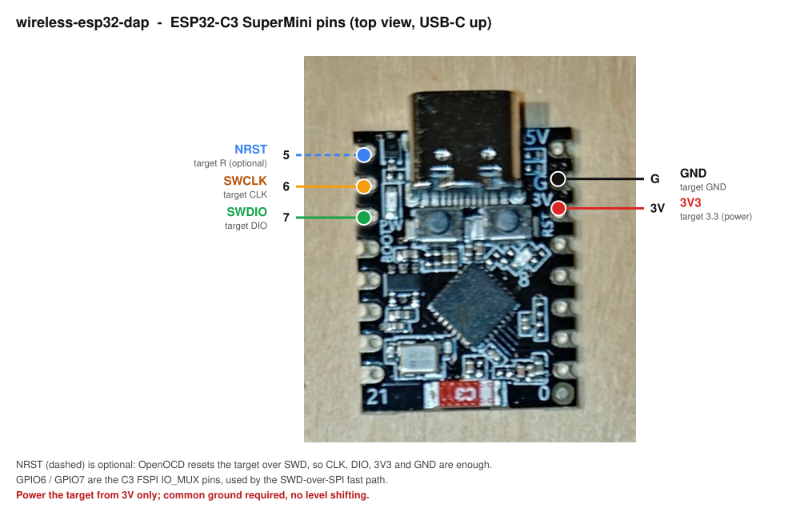
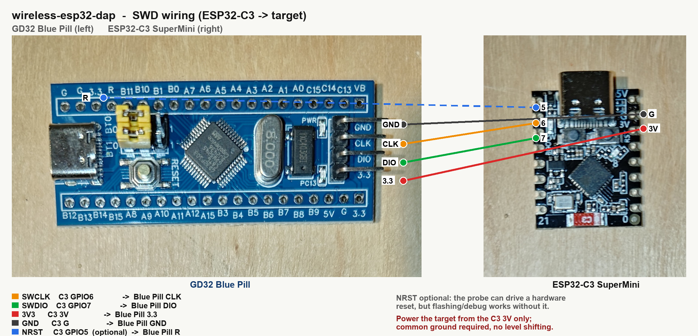

# wireless-esp32-dap

A wireless **CMSIS-DAP** SWD/JTAG probe firmware for the **ESP32 family** (ESP32 / ESP32-C3 /
ESP32-S3): drive OpenOCD or pyOCD over Wi-Fi instead of a USB debug cable.

This is a fork of [windowsair/wireless-esp8266-dap](https://github.com/windowsair/wireless-esp8266-dap)
**ported to ESP-IDF v5.x**. Upstream pins ESP-IDF v4.4.2 so it can share code with the ESP8266 RTOS
SDK. This fork does the v4.4 -> v5 migration and, in doing so, **drops ESP8266**: the 8266 path
relied on the `tcpip_adapter` / `system_event_t` APIs removed in IDF v5, so the networking here was
rewritten on `esp_netif`. The fork is named for the chips it now targets.

## Status

- **ESP32-C3: tested on hardware.** Built on IDF v5.4, flashed to an ESP32-C3 SuperMini, joined
  Wi-Fi, and used over the air to read an SWD target's IDCODE and to flash + verify firmware
  through it.
- **ESP32 / ESP32-S3: compile only.** They build cleanly in CI on `release-v5.4` but have not been
  run on hardware. They might work; treat them as unverified.
- **ESP8266: removed.** Not built, not supported.

## Wiring



Five wires from the ESP32-C3 SuperMini to the SWD target:

| Signal | C3 SuperMini | Target |
|--------|--------------|--------|
| SWCLK  | GPIO6        | CLK    |
| SWDIO  | GPIO7        | DIO    |
| NRST   | GPIO5        | reset (optional) |
| 3V3    | 3V           | 3.3    |
| GND    | G            | GND    |

On the C3 SuperMini, GPIO6/GPIO7 are the FSPI IO_MUX pins, which is what lets the SWD-over-SPI path
reach its higher clock.

- NRST is optional: OpenOCD resets the core in software over SWD, so `CLK/DIO/3V3/GND` are enough
  to connect, read IDCODE, flash and verify. The firmware *can* drive a hardware reset (SRST) on
  GPIO5 if you ask OpenOCD for one (`reset_config srst_only`), but it isn't required.
- Power the target from the C3's 3V only; do not also connect the target's own USB.
- Common ground is required; both sides are 3.3 V, so no level shifting.

### Example: GD32F103 "Blue Pill" target



This is the setup the C3 port was verified on: an ESP32-C3 SuperMini driving a GD32F103 Blue Pill
(Cortex-M3) over the air. Four wires land on the Blue Pill's 4-pin SWD header (`GND/CLK/DIO/3.3`);
NRST is the separate `R` pin on the top row.

## Build & flash

Toolchain: ESP-IDF v5.x (tested with v5.4). Tested chip: ESP32-C3.

```
. $IDF_PATH/export.sh
idf.py set-target esp32c3        # or esp32 / esp32s3 (untested on hardware)
idf.py build
```

All targets share the project's root `sdkconfig`, so switching target needs a re-assert (otherwise
you get a "generated for target X but CMakeCache contains Y" error):
```
idf.py -B build set-target esp32c3
```

Flash the C3 over USB (it enumerates as `/dev/ttyACM0`, native USB-Serial-JTAG; with your user in
the `dialout` group, no sudo):
```
idf.py -p /dev/ttyACM0 flash
```
or directly with esptool:
```
esptool --chip esp32c3 -p /dev/ttyACM0 -b 460800 --before default_reset --after hard_reset \
  write_flash --flash_mode dio --flash_size 2MB --flash_freq 80m \
  0x0     build/bootloader/bootloader.bin \
  0x8000  build/partition_table/partition-table.bin \
  0x10000 build/wireless_esp_dap.bin
```

Wi-Fi: add your AP to `main/wifi_configuration.h` `wifi_list[]` (DHCP by default; credentials are
compiled into the image in plaintext):
```c
{.ssid = "YourSSID", .password = "YourPassword"},
```

mDNS is disabled, so find the probe by its DHCP address. It listens on TCP **3240**:
```
sudo masscan 192.168.0.0/24 -p3240     # the host with 3240 open is the probe
```

## Connect over Wi-Fi

OpenOCD/pyOCD expect a CMSIS-DAP probe as a local USB device, but this probe is on Wi-Fi, so a
bridge is needed. We use **elaphureLink**: a patched OpenOCD that speaks the firmware's TCP protocol
directly, in userspace, with no USBIP and no root (<https://github.com/windowsair/openocd-elaphurelink>).

Prebuilt binaries are x86-64 only, so on arm64 (e.g. a Raspberry Pi) build from source. The recipe
clones upstream OpenOCD at a pinned commit and applies the elaphureLink patch:
```
sudo apt-get install -y build-essential libtool pkg-config \
  libcapstone-dev libhidapi-dev libftdi1-dev libusb-1.0-0-dev libuv1-dev libjaylink-dev

git clone --recursive https://github.com/windowsair/openocd-elaphurelink
cd openocd-elaphurelink
git clone --recursive https://github.com/openocd-org/openocd.git
cd openocd
git checkout cd9e64a25ac167d188859e991201d3fe492a91e1
git apply ../patch/*.patch
cp ../cmsis_dap_elaphurelink.c src/jtag/drivers
cp ../elaphurelink.cfg            tcl/interface
./bootstrap && ./configure --prefix=$PWD/../install && make -j4 && make install
```

Identify the core through the probe (read the CoreSight ROM table):
```
openocd -s openocd/tcl \
  -c "adapter driver cmsis-dap" -c "cmsis-dap backend elaphurelink" \
  -c "cmsis-dap elaphurelink addr 192.168.0.245" \
  -c "transport select swd" -c "adapter speed 1000" -c "set CPUTAPID 0" \
  -f target/stm32f1x.cfg -c "init" -c "dap info" -c "shutdown"
```

Flash + verify a firmware image (STM32F1 / GD32F103-class target):
```
openocd -s openocd/tcl \
  -c "adapter driver cmsis-dap" -c "cmsis-dap backend elaphurelink" \
  -c "cmsis-dap elaphurelink addr 192.168.0.245" \
  -c "transport select swd" -c "adapter speed 1000" -c "set CPUTAPID 0" \
  -f target/stm32f1x.cfg -c "program firmware.elf verify reset exit"
```
`set CPUTAPID 0` skips the IDCODE check so a GD32 (or other STM32F1-compatible part) is accepted.

(Stock OpenOCD also works via USBIP if you prefer: `apt install usbip`, `modprobe vhci-hcd`,
`sudo usbip attach -r <ip> -b <busid>`, then `interface/cmsis-dap.cfg`. That path needs root.)

## What the v5 port changed
- soc/hal includes moved to the v5 public paths (`soc/gpio_struct.h`, `hal/gpio_ll.h`, ...).
- include `hal/dedic_gpio_cpu_ll.h` for the dedicated-GPIO CSRs (C3/S3).
- GPIO struct field rename, per target: C3 uses `out_sel`/`in_sel`, S3 keeps `func_sel`.
- `swo.h` uses the real FreeRTOS `EventGroupHandle_t`; `mbedtls_sha1_ret` -> `mbedtls_sha1`.
- networking: `tcpip_adapter` + `system_event_t` -> `esp_netif` + the new `esp_event` loop.
- mDNS disabled (managed-component vs legacy `register_component`); corsacOTA excluded (does not
  build on v5).
- CI matrix set to `[esp32, esp32c3, esp32s3]` on `release-v5.4`.

## Credits & license
Fork of `windowsair/wireless-esp8266-dap` (MIT). Original probe firmware by windowsair and
contributors; this fork adds the ESP-IDF v5.x port and ESP32-family scoping. See `LICENSE`.
